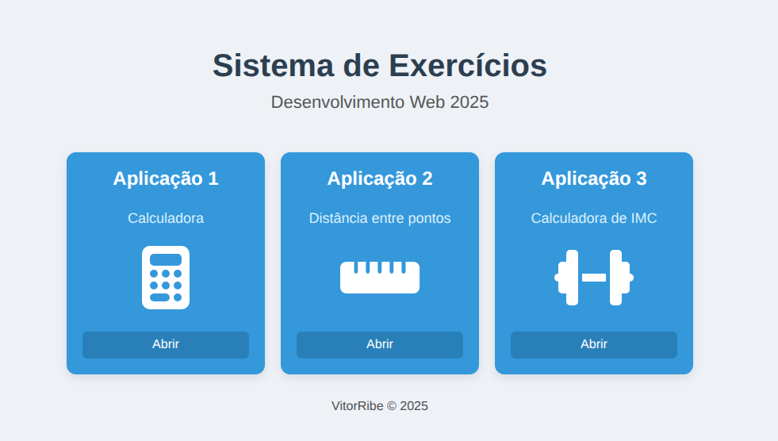
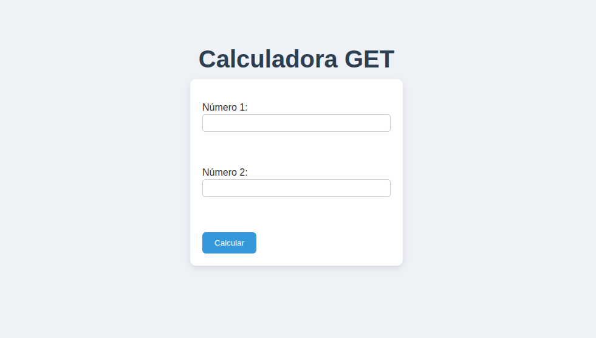
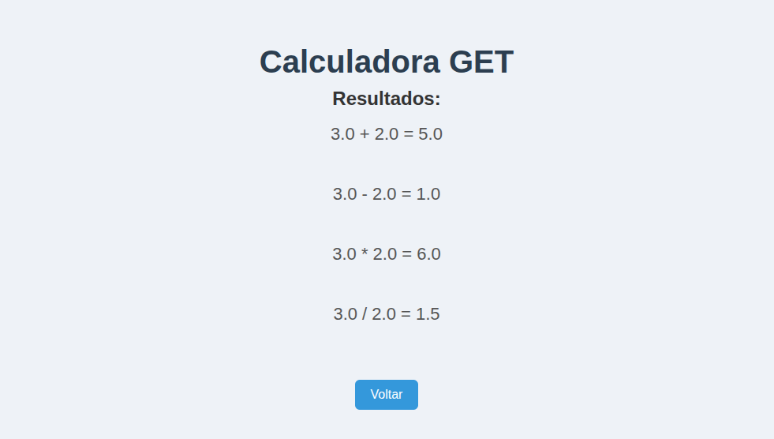
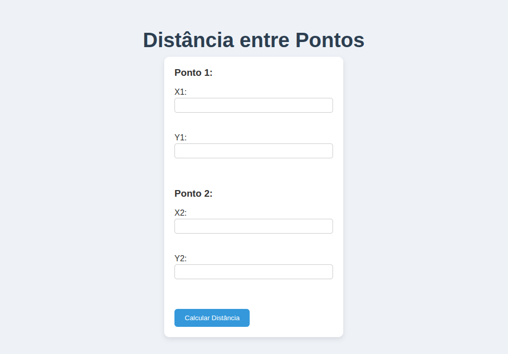
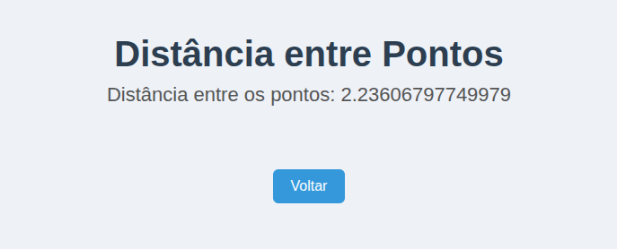
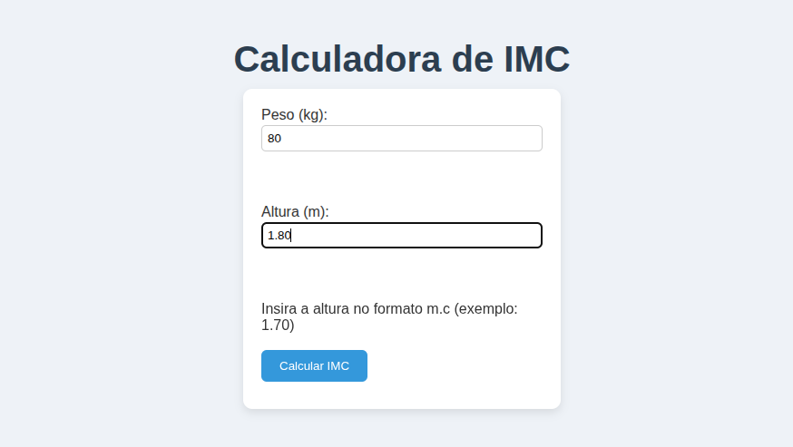
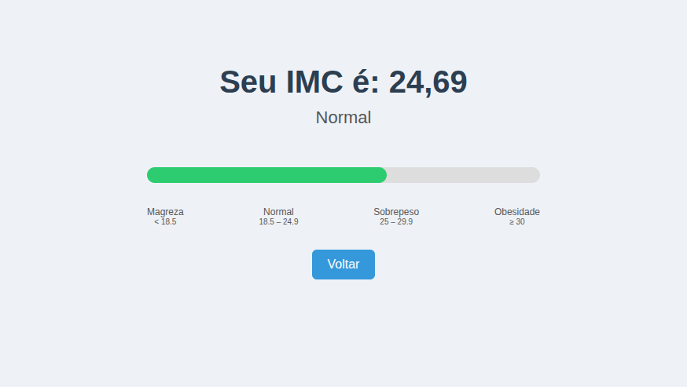

# Jakarta Enterprise Edition: Servlets

Trabalho para a disciplina de Desenvolvimento WEB — 5º período (Ciência da Computação).

---

## Resumo do projeto
Três pequenas aplicações web em **Jakarta EE** (Servlets) que demonstram envio de formulários HTML, tratamento de parâmetros, separação de regras de negócio e resposta em HTML. Estilo via `style.css` e ícones via Font Awesome.

---
<p align="center">
  
</p>
---

## Requisitos
- Java 21  
- NetBeans (ou IDE equivalente)  
- WildFly (configurado no NetBeans)  
- Maven (projeto Maven)  

---

## Estrutura do projeto
```
ExercicioServlets/
│
├─ src/main/java/io/github/vitorribe/joaobotelhoexercicioservlets/
│ │
│ ├─ servlets/
│ │ │
│ │ ├─ CalculadoraServlet.java (GET /calculadora)
│ │ ├─ DistanciaServlet.java (POST /distancia)
│ │ └─ IMCServlet.java (POST /imc)
│ │
│ └─ negocio/
│   │
│   ├─ Calculadora.java
│   ├─ Ponto.java
│   └─ IMC.java (com ResultadoIMC)
│
├─ src/main/webapp/
| |
│ ├─ index.html
│ ├─ aplicacao1.html
│ ├─ aplicacao2.html
│ ├─ aplicacao3.html
│ └─ style.css
|
└─ pom.xml
```


---

## Como compilar e rodar
1. Abra o NetBeans e importe/abra o projeto Maven.  
2. Configure WildFly em **Tools → Servers** (apontar para a pasta do WildFly).  
3. Build/Run pelo NetBeans: `Run` → deploy no WildFly.  
4. Acesse `http://localhost:8080/<context>` (o context é o nome do projeto — ver output do deploy).

---

## Aplicações

### 1) Calculadora (GET)

<p align="center">
  
</p>

- **Página:** `aplicacao1.html`  
- **Form:** `method="get"`, campos `num1` e `num2`  
- **Servlet:** `CalculadoraServlet`  
- **Classe de negócio:** `Calculadora.java`

**Fluxo**
1. Usuário envia dois números via GET.  
2. Servlet lê e converte os parâmetros (`num1`, `num2`).  
3. Chama `Calculadora.java` que retorna soma, subtração, multiplicação e divisão.  
4. Resposta exibida em HTML.


**Exemplo de saída**
<p align="center">
  
</p>

---

### 2) Distância entre pontos (POST)

<p align="center">
  
</p>

- **Página:** `aplicacao2.html`  
- **Form:** `method="post"`, campos `x1`, `y1`, `x2`, `y2`  
- **Servlet:** `DistanciaServlet`  
- **Classe de negócio:** `Ponto.java`

**Fluxo**
1. Form envia POST para `/distancia`.  
2. Servlet cria objetos `Ponto` e calcula a distância com `p1.distancia(p2)`.  
3. Resposta exibida em HTML.

**Exemplo de saída**
<p align="center">
  
</p>

---

### 3) Calculadora de IMC (POST)
<p align="center">
  
</p>

- **Página:** `aplicacao3.html`  
- **Form:** `method="post"`, campos `peso` (kg), `altura` (m)  
- **Servlet:** `IMCServlet`  
- **Classe de negócio:** `IMC.java` com `ResultadoIMC`

**Fluxo**
1. Servlet recebe peso e altura.  
2. Chama `IMC.calcular(peso, altura)` → retorna valor do IMC e classificação.  
3. HTML exibe:
   - Texto com resultado.  
   - Barra colorida (`div.imc-scale`) proporcional ao IMC.  
   - Legenda com faixas (`<18.5`, `18.5–24.9`, `25–29.9`, `>=30`). 


**Exemplo de saída**
<p align="center">
  
</p>


---

## CSS
- Estilos definidos em `style.css`, aplicado a todas as páginas.
